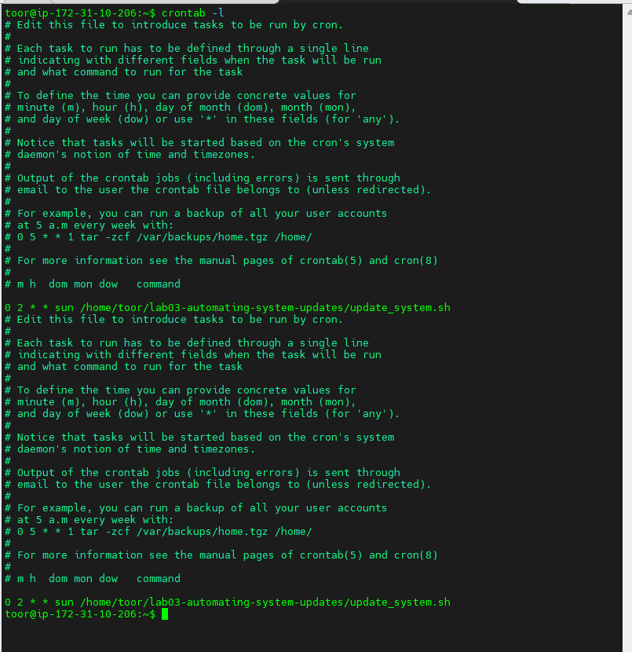

# Lab 3: Automating System Updates with Bash

## Objective
This lab teaches you how to automate Linux system updates using Bash scripting, schedule weekly updates using `cron`, and verify updates through log files.

## Step 1: Create and Test the Update Script
```bash
nano update_system.sh
```
Add this script:
```bash
#!/bin/bash
echo "Updating package lists..."
sudo apt update
echo "Upgrading installed packages..."
sudo apt upgrade -y
echo "Removing unnecessary packages..."
sudo apt autoremove -y
echo "Cleaning up package cache..."
sudo apt clean
echo "System updated successfully!"
```
Make it executable:
```bash
chmod +x update_system.sh
./update_system.sh
```

## Step 2: Schedule with Cron
```bash
crontab -e
```
Add this line to run every Sunday 2 AM:
```
0 2 * * SUN /home/toor/lab03-automating-system-updates/update_system.sh >> /home/toor/lab03-automating-system-updates/update_log.txt 2>&1
```
Check jobs:
```bash
crontab -l
```

## Step 3: Verify Logs
```bash
cat /home/toor/lab03-automating-system-updates/update_log.txt
cat /var/log/apt/history.log
```

## Screenshot


## Conclusion
You now have a fully automated Linux update process using cron and bash.
