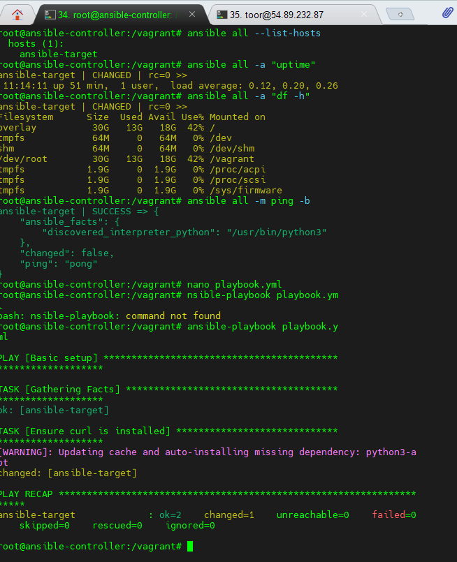

# Lab 04: Introduction to Ansible

## Objective
Set up a basic Ansible lab environment using Docker containers (Controller and Target) to test Ansible ad-hoc commands and playbooks.

## Overview
This lab demonstrates how to create a simple Ansible setup with two Ubuntu containers using Docker, configure SSH access, install Ansible on the controller, and verify connectivity with the target.

## Steps
1. Create two containers: `ansible-controller` and `ansible-target`
2. Install necessary packages (SSH, Python, Ansible)
3. Configure SSH password-based authentication
4. Verify connectivity using `ansible all -m ping`
5. Run basic ad-hoc commands (`uptime`, `df -h`)
6. Execute a sample playbook (`playbook.yml`) to ensure Ansible is functioning correctly

## Screenshot

## Result
✅ Successful connection and playbook execution between controller and target.
